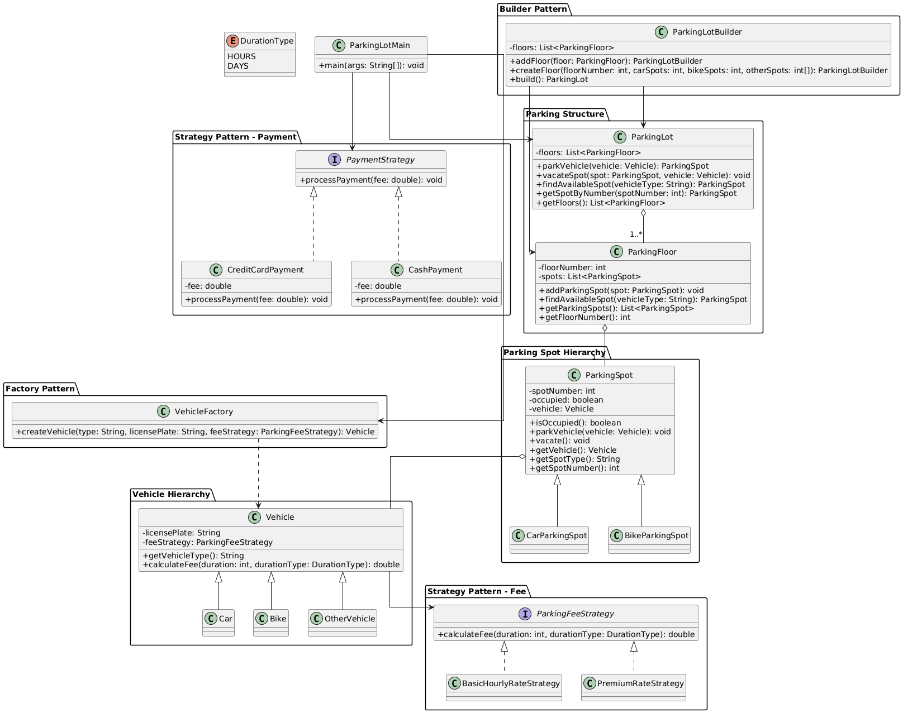

Requirements:
1.A parking lot with multiple slot types.

2.Support for bikes, cars, and trucks.

3.Dynamic slot allocation based on vehicle size.

4.Payment processing with multiple methods.

5.Entry ticket issuance and exit validation

Class Diagram
